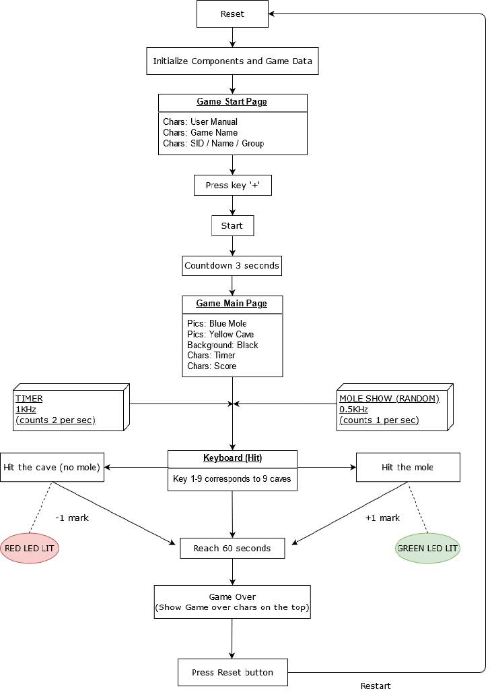

# WHACK-a-Mole Game 

### `Microcontrollers and Embedded Systems`

## I. OBJECTIVES
The “WHACK-a-Mole!!!” game aims to test players’ responsiveness. The player must tap the keys 1 to 9 if the layer has spotted a mole in the grids. Hit the moles as much as possible within a time range.

### (A) HERE ARE THE DETAILED GAME RULES OF THIS GAME:
1. After reset, the player will reach the start page of the game. The player will see the game instructions, including the game makers’ name, the game name, and the “PRESS ‘+’ to START GAME”.

2. If the player wishes to start the game, press the “+” key on the keyboard to start the game.

3. After entering the game, you will see a three by three grid. Some blue moles will be randomly pop out from one of the nine grids. Each mole will show up for 1 second. After that, only one mole will appear each second.

4. To evaluate the performance of the player, we have the following calculation of score:
(i) If a mole is hit, one mark will be awarded.
(ii) If a mole is missed, no mark will be got.
(iii) If the grid is empty and the player hit nothing, one mark will be deducted.
(iv) The minimum possible mark is 0 mark (no negative mark setting), and the maximum possible mark is 60 marks.

5. The duration of each game round is 1 minute.

6. After the game ends, no moles are pop up in the grid, and the “GAME OVER” sign is shown. The buzzer will sound to indicate the game is over.

7. Reset the game by pressing the reset button (We cannot finish the restart of the game by pressing the other key successfully due to the time limit).

### (B) LIST OF HARDWARE USED:
`LED:` Use LED to indicate whether a mole is hit. If a mole is hit, green light (DS1) will light. If nothing is hit (hit the blank cave/grid), the red light will light.

`Reset Button:` For uploading the code to the board and reset.

`TFTLCD:` Used as the primary display element for gaming graphical interface.

`Interrupt:` We use the PS2 keyboard as the interrupt. First, press the “+” key will start the game. Then, press “1” to “9” keys (total nine keys) to hit the moles to get the score.

`Two Timers (TIM3 & TIM4):`
TIM3 is used to count the remaining time down of each game round. (From the 60s to 0s)
TIM4 is used to display the mole locations at each second.

`USART:` Used for debugging and uploading the program code to the board.

`Buzzer:` Used to indicate the game over the condition.

### (C) PROGRAM FLOW:

---

## II. IMPLEMENTATION
In this part, we will illustrate several key functions in our code to help explain how the hardware is applied to our game in a detailed manner.
(`We will ignore this part in GitHub`)

--- 

## III. TESTING, DIFFICULTIES AND SOLUTIONS
First, we tested the game introduction page, the countdown before the game started, the game main page and the game over page about 30 times, and they all worked normally.

Then we started to test the effect of the game. At first we imagined that the player would add one point after hitting the mole. Unfortunately, we found that the player would add two points after hitting the mole. After checking, we found that the global moleflag that was originally defined was reset in another function. Therefore, we can solve this problem by setting it to -1.
Besides, when the mole appeared and disappeared, we found that the screen was still mixed with other colours and was not completely refreshed. This greatly affects the user experience. Therefore, we judged in the if else statement that if it is not hit, the other caves maintain their original colors. This is solved.
Moreover, we encountered great difficulties in formulating moles to appear randomly, and finally we thought of defining a constantly changing seed (rnd = rand()% 9) in while(1) to judge 1-9 caves. This solves this problem perfectly.

Finally, we still have two difficulties that have not yet been resolved due to the relationship of time. The first one is about the LED light. We assume that when the player hits the mole, it will show a green light. When the player hits empty cave, a red light will be displayed. We think this is a problem with the keyboard because when we press hard, the green light and red light will not appear at the same time, it is perfect and working. But when we press lightly, sometimes these two lights will appear simultaneously, which is very strange. This is well worth continuing discussion. The second is about the problem of restarting the game except by pressing the reset button. We tried to let the user press key '0' in while(1) and then change the flag of the global variable to restart the game. But the value of the flag does not change after pressing. Therefore, we will continue to try to solve this problem in the follow-up.

---

## IV. SUMMARY
In this mini-project of making a "WHACK-a-Mole" game, we have used most of the 5 labs' components and computer organization knowledge.
1. We have used the LED and buzzer attached to make effects of the game to attract the players' attention. We need to put them in the code where it is appropriate.
2. We have used the USART cable for debugging and uploading the code smoothly to refine our game frequently and conveniently.
3. We have used the TFTLCD (the monitor) to display the game interface and make it more colourful. We have learnt a lot about designing our game by drawing lines and pictures by getting the width and height in pixels writing C codes. We have also learnt how to apply ASCII code for typing Englishh words, creating own characters or objects using pixel drawing and mixing colors by trying different hex number representations.
4. We have used the PS2 keyboard for making several interrupts for players to have more interactions with the game. We learnt that keys have their respective hex code for transmission. And hex code of 0xF0 is for key release. So using different keys can make the game more interesting.
5. Using timers in the game can prevent the game from being endless. The player can get the duration of a game round accurately. Moreover, it makes the randomization and show-up time of the game object more regular and in order. Timer also increases flexibility since the game producer can adjust the timer counting frequency. It replaces the delay() function as timers allow interrupts of the game while delay() function don't.